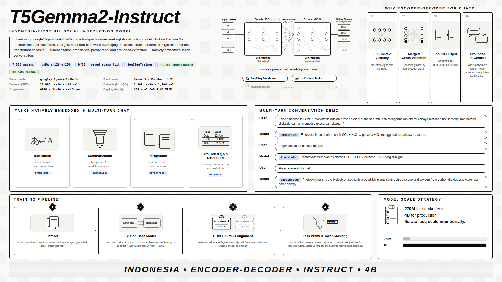
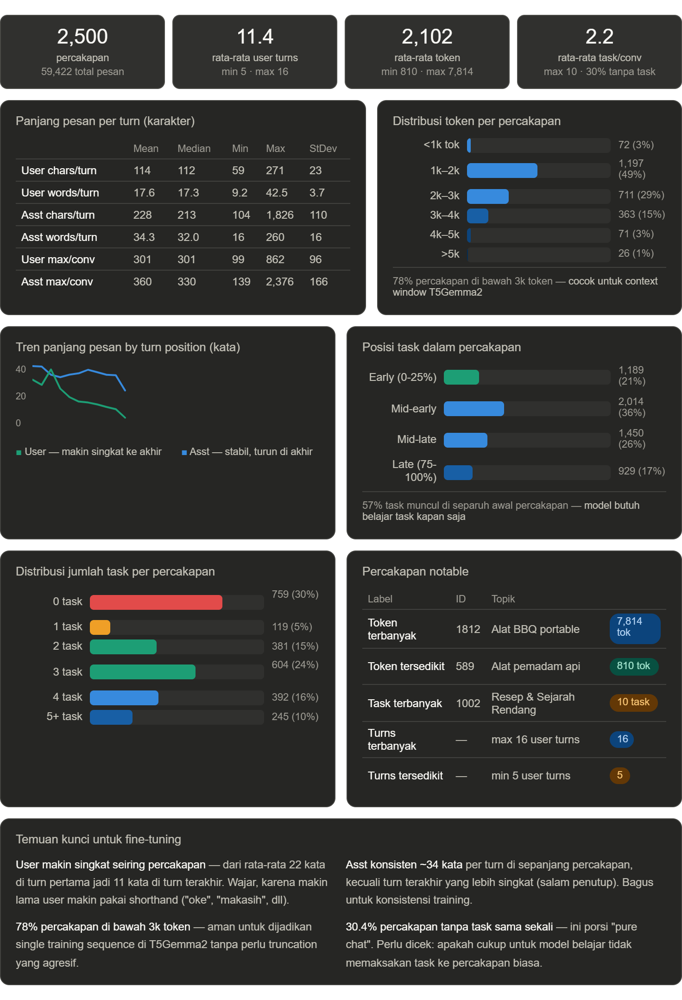

# 🇮🇩 T5-Gemma-2 Instruct & Chat Pipeline (Bahasa Indonesia)

Pipeline instruksi dan percakapan (instruction-tuning & chat) berbasis arsitektur **Encoder-Decoder (Seq2Seq)** menggunakan **T5-Gemma-2 (4B & 270M)** yang dioptimalkan secara penuh menggunakan metode **Supervised Fine-Tuning (SFT)** dan **Direct Preference Optimization (DPO)**.

---

## 🖼️ Project Infographic & Training Flow

Berikut adalah visualisasi arsitektur, spesifikasi dataset, dan alur pelatihan proyek ini:

### 1. Project Infographic


### 2. Dataset Specification


---

## 🚀 Deskripsi Proyek (Project Overview)

Proyek ini dirancang untuk melatih dan menguji model **T5-Gemma-2** agar optimal dalam memahami dan merespons instruksi serta percakapan dalam **Bahasa Indonesia** (prioritas utama) dan **Bahasa Inggris** (sekunder/bilingual). 

### Mengapa Memilih Arsitektur Encoder-Decoder (Seq2Seq)?
Meskipun arsitektur *decoder-only* mendominasi lanskap LLM saat ini, arsitektur *encoder-decoder* seperti T5-Gemma-2 menawarkan keunggulan unik:
1. **Asymmetric Processing**: Sangat efisien untuk tugas dengan input panjang (konteks/dokumen) yang menghasilkan output pendek (respons/ringkasan).
2. **Explicit Cross-Attention**: Encoder memproses seluruh input secara bidirectional sebelum decoder bekerja, mencegah masalah *attention degeneration* (lupa detail awal).
3. **Task Flexibility**: Sangat unggul dalam tugas terstruktur seperti peringkasan (*summarization*), penerjemahan (*translation*), ekstraksi data, dan *grounded QA* di tengah percakapan.

---

## 🏗️ Detail Arsitektur: Gemma 3 vs T5Gemma2

T5-Gemma-2 dibangun melalui adaptasi model Gemma 3 menggunakan metode UL2.

| Aspek | Gemma 3 (4B) | T5Gemma2 (4B-4B) |
| :--- | :--- | :--- |
| **Arsitektur** | Multimodal Decoder-only | **Multimodal Encoder-Decoder** |
| **Model Type** | `gemma3` | `t5gemma2` |
| **Total Parameter** | **~4.28B** (3.88B text + 0.4B vision) | **~7.51B** (3.88B enc + 3.88B dec + 0.4B vis) |
| **Attention** | Standard Self-Attention | **Merged Attention** (Self + Cross) |
| **Tied Embeddings** | ✅ Yes (Embed ↔ Head) | ✅ Yes (Enc ↔ Dec ↔ Head) |
| **Vocab Size** | 262,208 (extra 64 padding) | 262,144 (exact) |

### Mekanisme Merged Attention
T5-Gemma-2 tidak memiliki modul `cross_attention` terpisah di decoder. Sebagai gantinya, ia menggunakan **Merged Attention**:
- **Query (Q)**: Dibentuk dari decoder hidden states.
- **Key (K) & Value (V)**: Dibentuk dengan menggabungkan (*concatenate*) decoder input dan encoder output secara sekuensial.
- **Masking**: Kombinasi bidirectional (untuk token encoder) dan causal (untuk token decoder).

---

## 🎯 Metode Pelatihan: Supervised Fine-Tuning (SFT) & Alignment (DPO)

Proyek ini melatih model secara langsung menggunakan kombinasi SFT dan DPO pada dataset Bahasa Indonesia berkadar tinggi, menghindari kompleksitas transplantasi bobot:

1. **Supervised Fine-Tuning (SFT)**:
   - **T5-Gemma-2 270M**: Pelatihan ringan untuk iterasi cepat dan *smoke testing*.
   - **T5-Gemma-2 4B-4B**: Pelatihan penuh menggunakan LoRA $(r=128, \alpha=256)$ melatih ~755 juta parameter (~10.6% dari total model) pada seluruh dataset (31.299 sampel).
2. **Logit Masking**:
   - Memblokir logits untuk token yang tidak digunakan (*unused tokens*) dan token visual di encoder guna memastikan stabilitas generasi teks dan mencegah halusinasi token non-teks.
3. **Implicit Task Steering & Unused Tokens as Task Prefix**:
   - Melatih encoder secara implisit untuk memetakan representasi *hidden states* dari input *user* yang murni menggunakan bahasa natural tanpa awalan kaku.
   - Di sisi decoder, model akan mendeteksi intent dari percakapan dan secara mandiri mendeklarasikan *task prefix* menggunakan **Unused Tokens** (seperti `<unused1>` untuk *summarize*, `<unused2>` untuk *translate*) sesaat setelah token awal (BOS) sebelum menghasilkan teks utama. Ini berfungsi sebagai konfirmasi *intent* (mirip *Chain-of-Thought* tugas ringkas) yang meningkatkan koherensi respons *multi-task* secara drastis, tanpa perlu mencemari bahasa natural dengan *prompt user* berformat khusus.

---

## 📊 Dataset Spesifikasi (Update V2)

Dataset yang digunakan berfokus pada kualitas tinggi dan format multi-turn dalam Bahasa Indonesia:
1. **`chat_multiturn`**: 3.000 percakapan utuh multi-turn (500 data Agentic Prefix-Task baru, beserta 2.500 data lama yang telah dikonversi menyeluruh agar formatnya konsisten dengan data baru). Saat dipecah (unroll) untuk data latih (SFT), total menjadi 36.015 baris (turn) pelatihan SFT.
2. **`indoqa_documents`**: ~4.400 contoh pemahaman bacaan dan Q&A berbasis dokumen Indonesia.

Format data menggunakan skema OpenAI/ChatML standar:
```json
{
  "messages": [
    {"role": "system", "content": "Sistem prompt Bahasa Indonesia..."},
    {"role": "user", "content": "Pertanyaan user..."},
    {"role": "assistant", "content": "Jawaban model..."}
  ]
}
```

---

## ⚙️ Pipeline Pelatihan & Validasi

### 1. Persiapan Data (Data Preprocessing)
Gabungkan dataset mentah dan lakukan pemisahan data training serta validasi:
```powershell
# 1. Merge nested conversation base + extra
python scripts/dataset/merge_nested_conversations_jsonl.py

# 2. Rebuild chat_train.jsonl dan chat_val.jsonl
python scripts/dataset/rebuild_chat_sft_from_nested.py

# 3. Trim IndoQA dataset ke 2.500 baris untuk kurasi optimal
python scripts/dataset/trim_indoqa_train.py
```

### 2. Menjalankan Supervised Fine-Tuning (SFT)
Kami menyediakan skrip untuk model versi ringan (270M) untuk iterasi cepat, serta versi penuh (4B):
```powershell
# Jalankan SFT 270M (Smoke test / Lightweight training)
python scripts/training/train_clean_270m.py

# Jalankan SFT 4B LoRA (A100 GPU)
python scripts/training/train_clean_4b.py
```

### 3. Alignment dengan DPO
Gunakan Direct Preference Optimization untuk mematangkan gaya bahasa asisten dan meminimalkan halusinasi:
```powershell
# Generate dataset preferensi DPO
python scripts/dataset/generate_dataset_preferences_deepseek.py

# Jalankan DPO training (lightweight)
python scripts/training/train_dpo_270m_light.py
```

---

## 💬 Web-based Chat Simulator

Proyek ini dilengkapi dengan aplikasi simulasi chat berbasis web (Flask) untuk menguji model secara langsung melalui antarmuka web interaktif yang modern.

### Cara Menjalankan Chat Simulator:
1. Pastikan Anda berada di environment Python yang sesuai.
2. Jalankan server Flask:
   ```powershell
   python app/server.py
   ```
3. Buka browser Anda dan akses: `http://127.0.0.1:5000`

---

## 🦥 Integrasi Unsloth (Patch Seq2Seq / T5-Gemma-2)

Untuk mempercepat proses pelatihan model **T5-Gemma-2** tanpa kendala memori (VRAM), proyek ini mendukung integrasi dengan **Unsloth** versi terbaru yang telah di-patch secara khusus untuk mendukung arsitektur *Encoder-Decoder* (Seq2Seq).

### Mengapa Membutuhkan Patch Kustom?
Unsloth secara default hanya mendukung arsitektur *Decoder-only* (seperti Llama, Mistral, Gemma 2 CausalLM). Jika langsung digunakan untuk Seq2Seq, model akan gagal dimuat atau mengalami crash *shape mismatch* karena panjang token input dan label yang berbeda. Patch kustom kami membenahi:
1. **Routing Model**: Mengarahkan pemuatan ke `AutoModelForSeq2SeqLM`.
2. **Task Type Mapping**: Memetakan LoRA ke `TaskType.SEQ_2_SEQ_LM`.
3. **Bypass Batch Sampler**: Melewati pemeriksaan dimensi *causal* yang kaku ketika mendeteksi arsitektur encoder-decoder.

### Cara Instalasi Unsloth Patched:
Kami telah menyediakan *fork* repositori Unsloth yang sudah ter-patch di GitHub: [daruoktab/unsloth](https://github.com/daruoktab/unsloth). Instal menggunakan perintah berikut pada environment Anda:
```powershell
uv pip install --force-reinstall --no-deps git+https://github.com/daruoktab/unsloth.git
```

### Jalankan Pelatihan Pengujian (Test Training Script):
Gunakan skrip pengujian berikut untuk memastikan modul terinstal dan berjalan dengan benar:
```powershell
python scratch/test_unsloth_training.py
```

---

## 📂 Struktur Direktori Proyek

```directory
t5-gemma-2-instruct/
├── app/                      # Aplikasi Web Chat Simulator
│   ├── server.py             # Backend Flask
│   └── templates/            # Frontend HTML/CSS
├── data/                     # Dataset (Chat & IndoQA)
├── docs/                     # Dokumentasi Master, Riset & Infografis
│   ├── ARCHITECTURE_MASTER.md
│   ├── project-infographic.png
│   └── t5_gemma2_training_flow.png
├── scripts/                  # Kumpulan Skrip Fungsional
│   ├── analysis/             # Analisis token & arsitektur
│   ├── dataset/              # Pembuatan & pembersihan dataset
│   ├── eval/                 # Evaluasi model & metrics
│   ├── tests/                # Unit testing inference & loss
│   └── training/             # Skrip pelatihan SFT dan DPO
├── inference.py              # Skrip inferensi CLI sederhana
├── .gitignore                # Konfigurasi pengabaian file Git
└── README.md                 # Dokumentasi utama (File ini)
```

---
*Proyek ini dikembangkan secara aktif untuk eksplorasi arsitektur Seq2Seq pada LLM generasi baru (Gemma 3 & T5-Gemma-2) dalam konteks Bahasa Indonesia.*
