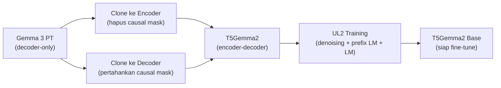
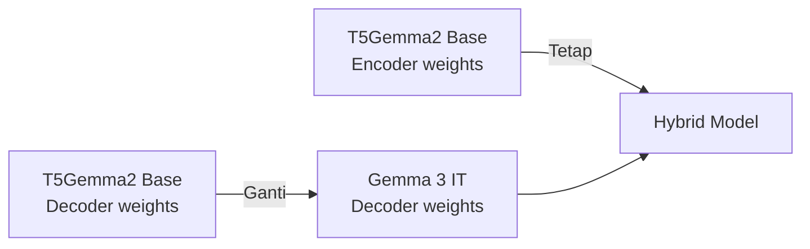

# Analisis: Transplantasi Decoder Gemma 3 IT → T5Gemma2

**Tanggal:** 12 Mei 2026  
**Ide:** Mengganti decoder T5Gemma2 base dengan weights dari Gemma 3 IT untuk mendapatkan kemampuan instruct "gratis"

---

## 1. Konteks: Bagaimana T5Gemma2 Dibuat

Berdasarkan paper T5Gemma 2 (arXiv:2512.14856), proses pembuatannya adalah:



Jadi **ya, decoder T5Gemma2 memang berasal dari Gemma 3 PT**. Lalu ditrain lagi dengan UL2 untuk belajar:
1. Encoder: membaca input secara bidirectional
2. Decoder: generate output sambil **attend ke encoder outputs** (via merged attention)

---

## 2. Ide Kamu: Transplantasi Langsung



**Apakah ini secara teknis bisa?** Ya, shapes-nya identik:
- `q_proj`: (2048, 2560) ✅
- `k_proj`: (1024, 2560) ✅
- `v_proj`: (1024, 2560) ✅
- `o_proj`: (2560, 2048) ✅
- `gate/up/down_proj`: ✅
- LayerNorms: ✅

> [!WARNING]
> **Tapi ada masalah fundamental: Merged Attention.**

---

## 3. Masalah Utama: Merged Attention ≠ Self-Attention

### Bagaimana Merged Attention Bekerja di T5Gemma2 Decoder

```
Standard Self-Attention (Gemma 3):
  Q = decoder_hidden × W_q
  K = decoder_hidden × W_k       ← hanya dari decoder
  V = decoder_hidden × W_v       ← hanya dari decoder
  Attn = softmax(Q·K^T) × V

Merged Attention (T5Gemma2):
  Q = decoder_hidden × W_q
  K = concat(encoder_output, decoder_hidden) × W_k   ← encoder + decoder!
  V = concat(encoder_output, decoder_hidden) × W_v   ← encoder + decoder!
  Attn = softmax(Q·K^T / √d, mask) × V
  
  mask = [bidirectional untuk encoder tokens | causal untuk decoder tokens]
```

### Mengapa Ini Bermasalah

Selama UL2 training, **W_k dan W_v T5Gemma2** belajar memproduksi representasi K/V yang **koheren** ketika dicampur dari dua sumber (encoder + decoder). Distribusi internalnya sudah beradaptasi.

**W_k dan W_v Gemma 3 IT** hanya pernah melihat decoder hidden states. Mereka **tidak pernah** belajar menangani encoder outputs. Jika kita transplant:

| Komponen | Transplant Aman? | Alasan |
|---|---|---|
| **MLP layers** (gate/up/down_proj) | ✅ **Aman** | MLP hanya proses hidden state per posisi, tidak peduli dari mana attention datang |
| **LayerNorms** | ✅ **Aman** | Normalisasi per-dimension, tidak tergantung attention pattern |
| **o_proj** | ⚠️ **Mungkin aman** | Project attention output → hidden, distribusi bisa bergeser sedikit |
| **q_proj** | ⚠️ **Risiko sedang** | Query masih dari decoder saja, tapi attention pattern berubah |
| **k_proj, v_proj** | ❌ **Berbahaya** | Ini yang paling terpengaruh merged attention! |

---

## 4. Strategi yang Lebih Aman (Dari Literatur)

### Strategi A: Partial Transplant (⭐ Rekomendasi Utama)

Transplant **hanya MLP + LayerNorm** dari Gemma 3 IT, pertahankan **attention weights** dari T5Gemma2 base.

```python
# Pseudocode
for layer_idx in range(34):
    # Copy MLP weights dari Gemma 3 IT
    t5_decoder.layers[layer_idx].mlp = gemma3_it.layers[layer_idx].mlp
    
    # Copy LayerNorm weights dari Gemma 3 IT  
    t5_decoder.layers[layer_idx].pre_feedforward_layernorm = ...
    t5_decoder.layers[layer_idx].post_feedforward_layernorm = ...
    
    # JANGAN copy attention weights — tetap dari T5Gemma2 base
    # t5_decoder.layers[layer_idx].self_attn = KEEP AS-IS
```

**Rasional:**
- MLP layers menyimpan sebagian besar "pengetahuan" dan "style" model
- Attention layers menyimpan "cara model mengolah konteks"
- Instruct tuning paling banyak mengubah MLP (mengubah *what* model knows/says)
- Attention relatif lebih stabil (mengubah *how* model attends)

### Strategi B: Weight Interpolation (SLERP/Linear)

Campur weights T5Gemma2 base dan Gemma 3 IT dengan rasio:

```python
# Linear interpolation
alpha = 0.3  # 30% IT influence — mulai konservatif
for name, param in t5_decoder.named_parameters():
    if name in gemma3_it_params:
        param.data = (1 - alpha) * t5_base_param + alpha * gemma3_it_param
```

**Kelebihan:** Lebih smooth, tidak ada "shock" arsitektural.
**Tools:** Bisa pakai `mergekit` untuk SLERP/TIES/DARE.

### Strategi C: LoRA Transfer (Paling Elegan)

1. Hitung **task vector** = Gemma 3 IT - Gemma 3 PT (delta yang membuat model instruct)
2. Apply task vector ke T5Gemma2 decoder

```python
# Hitung "instruksi delta"
task_vector = {}
for name in gemma3_it.state_dict():
    task_vector[name] = gemma3_it_weights[name] - gemma3_pt_weights[name]

# Apply ke T5Gemma2 decoder (scaled)
scale = 0.5  # mulai konservatif
for name, param in t5_decoder.named_parameters():
    mapped_name = map_layer_name(name)  # handle naming differences
    if mapped_name in task_vector:
        param.data += scale * task_vector[mapped_name]
```

**Rasional dari literatur:**
- Task Arithmetic (Ilharco et al., 2023): task vectors bisa ditambah/dikurang untuk transfer kemampuan
- Ini pada dasarnya apply "pengetahuan instruksi" tanpa menghapus adaptasi UL2

### Strategi D: Full Transplant + Cross-Attention Warmup

Jika tetap ingin full transplant:
1. Copy semua decoder weights dari Gemma 3 IT
2. **Freeze** semua weights kecuali attention (q/k/v/o_proj)
3. **Warmup** attention ~1.000 steps dengan data SFT (agar K/V belajar ulang menangani encoder outputs)
4. Unfreeze semua, lanjut SFT normal

---

## 5. Hambatan Teknis yang Harus Diselesaikan

### A. Embedding Size Mismatch
```
Gemma 3 IT: embed_tokens = (262.208, 2560)  ← 64 extra padding
T5Gemma2:   embed_tokens = (262.144, 2560)
```
**Solusi:** Truncate ke 262.144 rows pertama (padding slots tidak bermakna).

### B. Layer Name Mapping
```python
# Mapping yang diperlukan:
NAME_MAP = {
    "model.layers.{i}.input_layernorm":          "model.decoder.layers.{i}.pre_self_attn_layernorm",
    "model.layers.{i}.post_attention_layernorm":  "model.decoder.layers.{i}.post_self_attn_layernorm",
    "model.layers.{i}.self_attn.{proj}":          "model.decoder.layers.{i}.self_attn.{proj}",
    "model.layers.{i}.mlp.{proj}":                "model.decoder.layers.{i}.mlp.{proj}",
    # pre/post_feedforward_layernorm → sama
}
```

### C. Tied Embeddings
T5Gemma2 shared embeddings: encoder ↔ decoder ↔ lm_head. Jika hanya mengganti decoder, konsistensi embedding bisa terganggu. Pertimbangkan:
- Jangan transplant `embed_tokens` decoder (karena tied ke encoder)
- Atau transplant lalu re-tie

---

## 6. Ranking Strategi (Rekomendasi)

| # | Strategi | Effort | Risk | Expected Gain | Rekomendasi |
|---|---|---|---|---|---|
| 1 | **Task Vector Transfer** (§4C) | Rendah | Rendah | Sedang–Tinggi | ⭐⭐⭐ Terbaik |
| 2 | **Partial Transplant** MLP+LN (§4A) | Rendah | Rendah | Sedang | ⭐⭐⭐ |
| 3 | **Weight Interpolation** SLERP (§4B) | Rendah | Sedang | Sedang | ⭐⭐ |
| 4 | **Full Transplant + Warmup** (§4D) | Sedang | Tinggi | Tinggi jika berhasil | ⭐ |
| 5 | **Full Transplant tanpa warmup** | Sangat rendah | ❌ Sangat tinggi | Kemungkinan rusak | ❌ |
| 6 | **SFT biasa** (tanpa transplant) | Sedang | Sangat rendah | Terbukti | ⭐⭐⭐ (baseline) |

> [!IMPORTANT]
> **Rekomendasi saya: Coba Strategi C (Task Vector Transfer) + lanjut SFT ringan.**
> 
> Alasannya:
> 1. Mempertahankan adaptasi UL2 yang sudah ada di T5Gemma2 (tidak menghapus kemampuan encoder-decoder)
> 2. Menambahkan "delta instruksi" dari Gemma 3 IT secara aditif
> 3. Bisa dikontrol dengan `scale` parameter (mulai dari 0.3, tune up/down)
> 4. Lalu dilanjutkan SFT ringan (mungkin hanya perlu ~500 steps vs ~2000 tanpa transplant)

---

## 7. Risiko & Mitigasi

| Risiko | Mitigasi |
|---|---|
| Merged attention rusak setelah transplant | Pakai partial transplant (MLP saja) atau task vector dengan scale rendah |
| Embedding inconsistency (tied weights) | Jangan transplant embedding layers, hanya internal layers |
| Degradasi encoder-decoder coherence | Monitor cross-attention patterns di validation |
| Overshoot (terlalu banyak IT influence) | Mulai dengan scale=0.3, naikkan bertahap |

---

## 8. Kesimpulan

**Ide kamu secara prinsip benar** — decoder T5Gemma2 memang berasal dari Gemma 3 PT, jadi secara teori bisa "di-upgrade" ke IT. Namun **full transplant langsung berisiko tinggi** karena merged attention sudah diadaptasi selama UL2.

Pendekatan terbaik adalah **Task Vector Transfer**: menghitung delta (IT - PT) lalu menambahkannya secara terukur ke T5Gemma2 decoder. Ini mempertahankan adaptasi UL2 sambil menyuntikkan kemampuan instruksi.

Apakah ingin saya buatkan script untuk mengimplementasikan salah satu strategi di atas?
