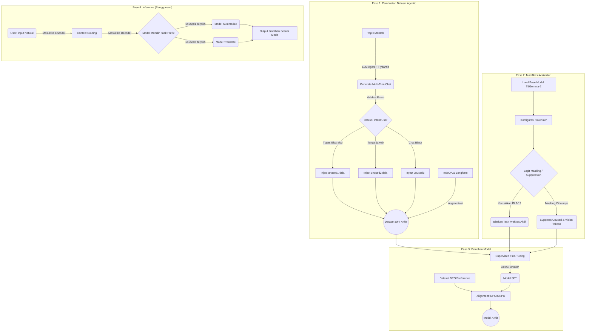

# Algoritma & Pipeline Proyek: T5Gemma-2-Instruct (Assistant-Driven Prefix)

Dokumen ini memetakan alur logika (algoritma) dari hulu ke hilir proyek *fine-tuning* model *encoder-decoder* T5Gemma-2 untuk percakapan *multi-turn* bahasa Indonesia.

## 🌊 Diagram Alir Utama (Mermaid)

---

## 📝 Penjelasan Langkah Algoritma (Step-by-Step)

### 1. Algoritma Pembuatan Dataset (*Data Generation*)
*Tujuan: Membangun data latih di mana Asisten menggunakan Task Prefix.*
1. **Input:** Daftar topik mentah.
2. **Proses Agen:** Untuk setiap topik, inisialisasi *Agent Pydantic AI*.
3. **Looping (Turn-by-turn):**
   - Agen menghasilkan pesan User (bahasa natural).
   - Agen mengklasifikasikan *intent* User ke dalam daftar `Enum` (Misal: `SUMMARIZE`, `TRANSLATE`).
   - Agen menggabungkan token *prefix* (contoh: `<unused1>`) di **awal** teks balasan Asisten.
4. **Validasi:** Cek apakah panjang percakapan memenuhi batas minimal (misal 10 *turns*).
5. **Output:** File JSONL yang berisi percakapan bersarang (*nested chat*).

### 2. Algoritma Modifikasi Tokenizer (*Logit Masking*)
*Tujuan: Membersihkan arsitektur dari token sampah tanpa membunuh token Prefix.*
1. Load daftar ID untuk *Unused Tokens* (Blok 1: ID 6-104, Blok 2: ID 256002-262143) dan *Vision Tokens*.
2. Buat daftar pengecualian untuk ID 7 hingga 12 (mewakili `<unused1>` hingga `<unused6>`).
3. Gabungkan sisa ID menjadi satu array besar (`ALL_SUPPRESS_IDS`).
4. Saat *training/inference*, atur *logits* dari `ALL_SUPPRESS_IDS` menjadi `-infinity` agar model tidak pernah bisa memprediksi/mengeluarkan token tersebut.

### 3. Algoritma Pelatihan (*Training Loop*)
*Tujuan: Melatih model Encoder-Decoder untuk menguasai Prefix & Chat.*
1. **SFT (Supervised Fine-Tuning):**
   - **Encoder** menerima teks User secara murni.
   - Melalui *Merged Cross-Attention*, **Decoder** dipaksa memprediksi *Task Prefix* sebagai token pertama.
   - Hitung *Loss* hanya pada teks balasan Decoder. Lakukan *Backpropagation* via Unsloth LoRA.
2. **Alignment (DPO/ORPO):**
   - Bandingkan probabilitas log (*log prob*) dari jawaban *Chosen* melawan jawaban *Rejected* (cacat, halusinasi, dsb).
   - Berikan penalti pada jawaban *Rejected* agar model menjauhi gaya bahasa tersebut.

### 4. Algoritma Inferensi (*Assistant-Driven Routing*)
*Tujuan: Bagaimana model berpikir saat dipakai oleh *end-user*.*
1. Pengguna mengetik: `"Tolong terjemahkan dokumen ini..."`.
2. Teks masuk ke **Encoder** tanpa tambahan apa pun.
3. **Decoder** mulai bekerja. Berdasarkan representasi dari Encoder, Decoder menyimpulkan: *"Oh, ini tugas translasi"*.
4. Decoder mengeluarkan token rahasia: `<unused2>`.
5. Karena mengeluarkan `<unused2>`, *internal state* / *attention* dari model bergeser ke **Mode Translasi**.
6. Decoder mengeluarkan teks terjemahannya hingga selesai.
