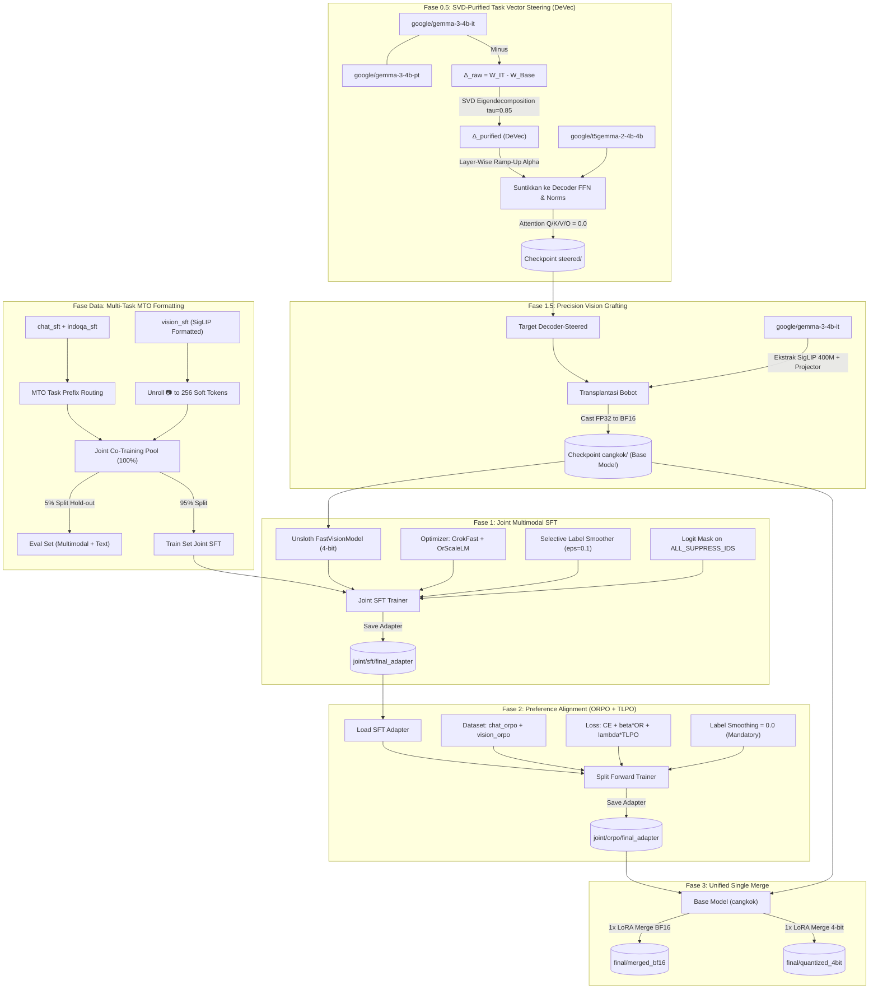

# Algoritma & Pipeline Proyek: T5Gemma-2-Instruct (V8 Joint Multimodal Blueprint)

Dokumen ini memetakan alur logika (algoritma) dari hulu ke hilir proyek *fine-tuning* model *encoder-decoder* T5Gemma-2 untuk percakapan *multi-turn* bahasa Indonesia dan multimodal vision (Pipeline V8).

## 🌊 Diagram Alir Utama Pipeline V8 (Mermaid)

---

## 📝 Penjelasan Langkah Algoritma (Step-by-Step V8)

### 1. Algoritma Task Vector Steering & DeVec Filtering (Phase 0.5)
1. **Input:** Bobot `Gemma 3 IT`, `Gemma 3 Base`, dan `T5Gemma 2 Base`.
2. **Delta Weight:** Hitung $\Delta = W_{\text{IT}} - W_{\text{Base}}$ untuk seluruh layer decoder.
3. **SVD Purification (DeVec):** Lakukan dekomposisi nilai singular pada $\Delta$, proyeksikan ke *column space*, dan pisahkan *shared subspace* ($\tau=0.85$) untuk membuang noise interferensi parameter.
4. **Layer-Wise Ramp-Up Injection:**
   - Layer awal ($<25\%$): $\alpha_{\text{FFN}}=0.05, \alpha_{\text{Norm}}=0.02$ (subtle).
   - Layer tengah ($25\%-80\%$): $\alpha_{\text{FFN}}=0.25, \alpha_{\text{Norm}}=0.08$ (peak reasoning).
   - Layer akhir ($>80\%$): $\alpha_{\text{FFN}}=0.08, \alpha_{\text{Norm}}=0.03$ (output calibration).
   - Attention ($Q, K, V, O$) dan $QK\text{-Norm}$ **wajib $\alpha=0.0$** (menjaga integritas Merged Attention $[X; H]$).
5. **Output:** Simpan dan upload model terverifikasi ke subfolder `steered/`.

### 2. Algoritma Vision Tower Grafting (Phase 1.5)
1. **Input:** Checkpoint `steered/` dan `google/gemma-3-4b-it`.
2. **Transplantasi:** Salin parameter `model.vision_tower` (SigLIP 400M, 27 layers) dan `model.multi_modal_projector` dari donor ke target.
3. **Precision Cast:** Konversikan seluruh bobot dan buffer float32 ke bfloat16 murni.
4. **Verifikasi:** Pastikan perbedaan matriks bobot target vs donor $< 1\times 10^{-6}$.
5. **Output:** Simpan dan upload base model training ke subfolder `cangkok/`.

### 3. Algoritma Multi-Task Joint SFT Co-Training (Phase 1)
1. **Input:** Base model `cangkok/`, dataset teks MTO (`chat_sft` + `indoqa_sft`), dan `vision_sft`.
2. **Token & Logit Masking:**
   - Terapkan forward hook pada `lm_head` untuk menekan `ALL_SUPPRESS_IDS` (penalti $-10000.0$).
   - Pengecualian: Biarkan token `<unused1>` hingga `<unused6>` (ID 7–12) aktif untuk *Assistant-Driven Task Prefix*.
3. **Optimizer OrScaleLM:**
   - Terapkan filter gradien *GrokFast* ($\alpha=2.0, \lambda=0.98$).
   - Matriks 2D LoRA diperbarui dengan *OrScaleLM* (Newton-Schulz 5-step + per-layer trust ratio scaling).
   - Parameter 1D diperbarui dengan *AdEMAMix*.
4. **Loss:** Gunakan `SelectiveLabelSmoother` ($\epsilon=0.1$) pada token yang valid.
5. **Output:** Simpan dan upload adapter ke `joint/sft/final_adapter`.

### 4. Algoritma Hybrid Alignment ORPO + TLPO (Phase 2)
1. **Input:** Model dengan adapter SFT, dataset `chat_orpo`, dan `vision_orpo`.
2. **Split Forward:** Jalankan forward encoder sekali, lalu forward decoder secara terpisah untuk *chosen* dan *rejected* (hemat 40% VRAM).
3. **Hybrid Loss:**
   $$\mathcal{L}_{\text{Total}} = \mathcal{L}_{\text{CE}}(\text{chosen}) + \beta \mathcal{L}_{\text{ORPO}} + \lambda_{\text{TLPO}} \mathcal{L}_{\text{TLPO}}$$
4. **TLPO Regularizer:** Berikan penalti pada titik kebingungan bahasa (*language confusion point*) di mana model menghasilkan token non-Indonesia.
5. **Constraint:** Label smoothing **wajib diset 0.0**.
6. **Output:** Simpan dan upload adapter ke `joint/orpo/final_adapter`.

### 5. Algoritma Unified Single Merge (Phase 3)
1. **Input:** Base model `cangkok/` dan adapter `joint/orpo/final_adapter`.
2. **Dtype Normalization:** Cast seluruh modul float32 ke bfloat16.
3. **Merge 1x:** Lakukan penggabungan LoRA ke base model satu kali.
4. **Export:** Ekspor bobot ke format BF16 (`final/merged_bf16`) dan format 4-bit NF4 (`final/quantized_4bit`).
5. **Upload:** Unggah ke Hugging Face dengan verifikasi marker `upload_complete.json`.
